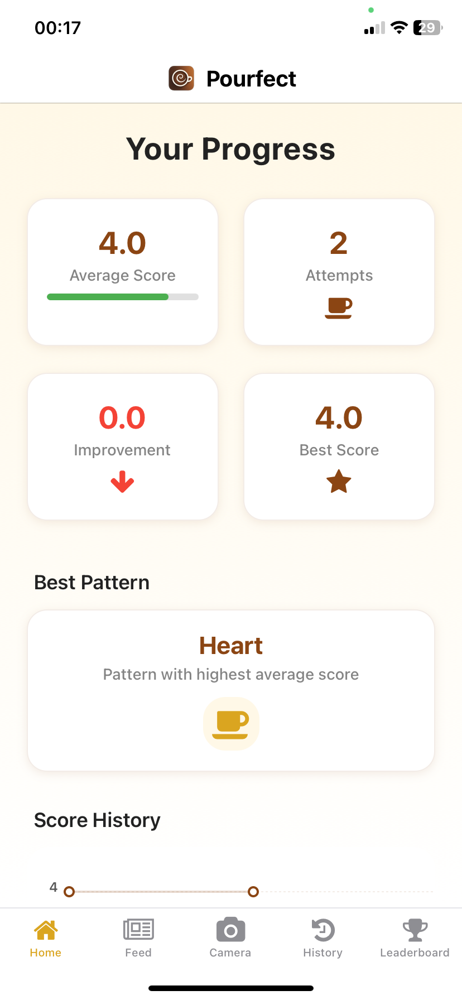
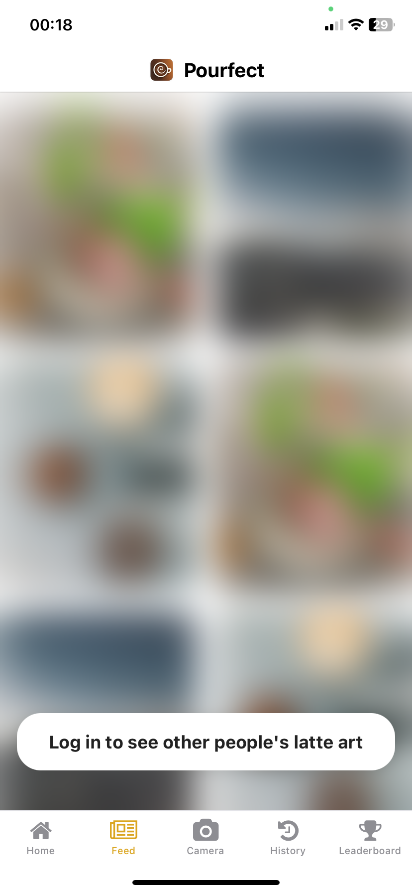
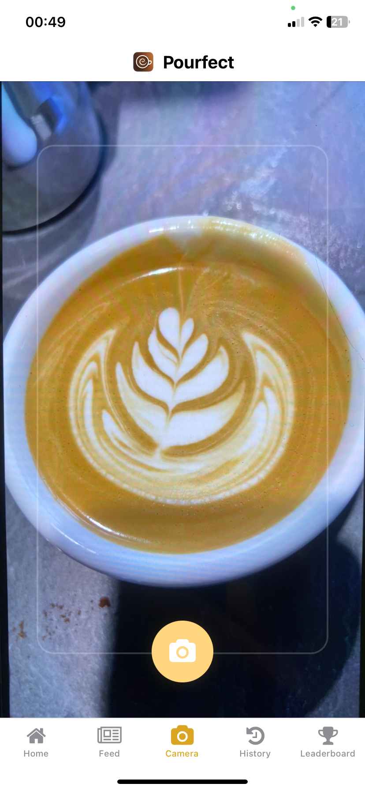
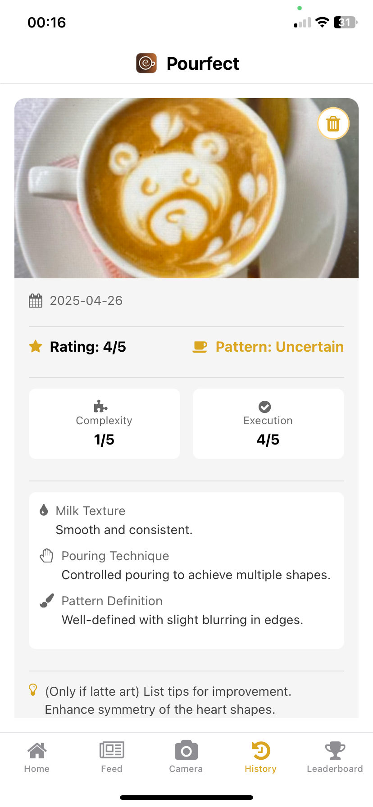
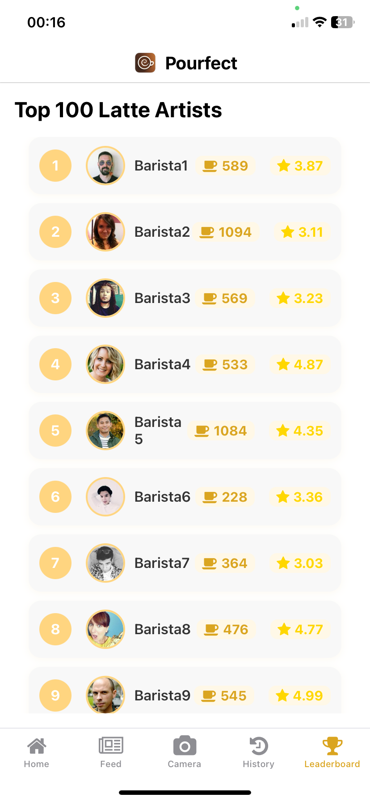

# Pourfect

Welcome to Pourfect, the AI-powered Latte Art App for aspiring baristas and coffee enthusiasts! Our app lets users capture and rate their latte art creations, providing fun, interactive and personalized feedback to help improve their skills over time. This project was developed by a team of four students during TUM.ai Makethon 2025 as part of OpenAI's open track. Built with React Native, Expo, TypeScript, and the OpenAI's API.

You can find our hackathon presentation slides in the `docs` folder: [Pitch Slides](docs/pourfect-pitch-slides.pdf)

Check out our presentation landing page: [Pourfect Website](https://pourfect.vercel.app/)

## Demo

To try out the demo of Pourfect, follow these steps:

1. **Clone the Repository:**
   ```bash
   git clone https://github.com/thisisalexn/latte-art-app.git
   cd latte-art-app
   ```

2. **Install Dependencies:**
   Make sure you have [Node.js](https://nodejs.org/) and [Expo CLI](https://docs.expo.dev/get-started/installation/) installed. Then run:
   ```bash
   npm install
   ```

3. **Provide the API Key:**
   To use the AI features of Pourfect, you need to provide an OpenAI API key. Follow these steps to set it up:
   - Create a `.env` file in the root of your project.
   - Add the following line to the `.env` file, replacing `your_api_key_here` with your actual API key:
     ```
     EXPO_PUBLIC_OPENAI_API_KEY=your_api_key_here
     ```

4. **Run the App:**
   You can run the app using the following command:
   - **Start the development server:**
     ```bash
     npx expo start
     ```

5. **Download Expo App:**
   Download the Expo app from the [App Store](https://apps.apple.com/us/app/expo-go/id982107779) or [Google Play Store](https://play.google.com/store/apps/details?id=host.exp.exponent). Once installed, scan the QR code provided in the terminal after running `npx expo start` to open the app on your device.

   ### Home Screen

*The main dashboard showing your recent latte art attempts and quick actions*

## Screenshots

### Feed

*Discover and learn from other baristas' creations*

### Camera

*Capture and analyze your latte art with AI-powered feedback*

### History

*Track your progress and view past attempts with detailed feedback*

### Leaderboard

*Compete with other baristas and track your rankings*

## Team

- [Alexander Nuss](https://github.com/thisisalexn)
- [Bakir Chaban](https://github.com/Kingmopser)
- [Emir Abdbybekov](https://github.com/EMIRABYBEKOV) 
- [Shohzodjon Sobirov](https://github.com/shodiBoy1)

## License

This project is licensed under the MIT License - see the [LICENSE](LICENSE) file for details.